# Procesverslag
Markdown is een simpele manier om HTML te schrijven.  
Markdown cheat cheet: [Hulp bij het schrijven van Markdown](https://github.com/adam-p/markdown-here/wiki/Markdown-Cheatsheet).

Nb. De standaardstructuur en de spartaanse opmaak van de README.md zijn helemaal prima. Het gaat om de inhoud van je procesverslag. Besteedt de tijd voor pracht en praal aan je website.

Nb. Door *open* toe te voegen aan een *details* element kun je deze standaard open zetten. Fijn om dat steeds voor de relevante stuk(ken) te doen.

## Jij

  
uitwerken voor kick-off werkgroep

  ### Auteur:
  Stef Keuken

  #### Je startniveau:
  Rood

  #### Je focus:
  Responsive
 

## Je website

  
uitwerken voor kick-off werkgroep

  ### Je opdracht:
  https://dreamhack.com/

  #### Screenshot(s) van de eerste pagina (small screen): 
  Homepage 
  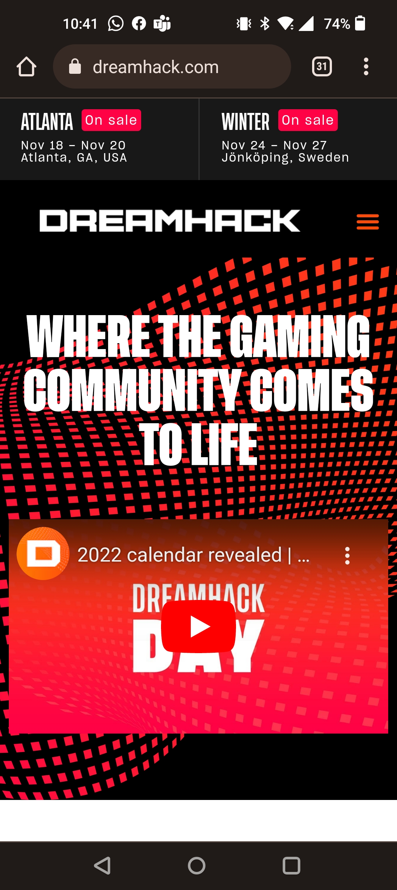

  #### Screenshot(s) van de tweede pagina (small screen):
  Partnerpage  
  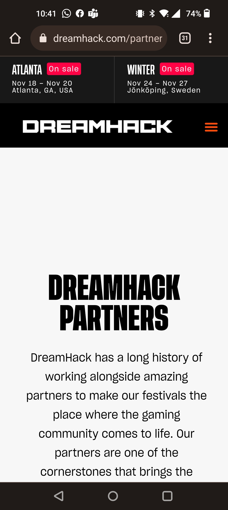
 

## Toegankelijkheidstest 1/2 (week 1)

  
uitwerken na test in 1e werkgroep

  ### Bevindingen
  Lijst met je bevindingen die in de test naar voren kwamen:

 button rechtsoven niet berijkbaar met screenreader
 goed contrast in website dus visueel beperkte mensen hebben er weinig last van

  #### Screenreader
  Hier korte omschrijving (met indien nodig afbeeldingen)

  Homepage - Kan niet verder in de header boven navbar klikken.

  Hier een omschrijving van hoe het opgelost kan worden (met indien nodig afbeeldingen)

  Geen oplossing nodig

  #### Muis en Toetsenbord 
  Hier korte omschrijving (met indien nodig afbeeldingen)

  Kleurtjes:
  
  Homepage - Goede kleurcombinatie zorgt voor geen problemen, geen dark/light mode vanwege stijl van website

  Partnerpage - Goede kleurcombinatie zorgt voor geen problemen, geen dark/light mode vanwege stijl van website
  
  Muis:
  
  Homepage - alle buttons geven feedback en hebben een hover state, alles is accessible
  Partnerpage - alle buttons geven feedback en hebben een hover state, alles is accessible
  
  Toetsenbord:
  
  Homepage - items in list geven geeft hover state wanneer overheen getabt
  
 
  
  Partnerpage - volledige page accesible met toetsenbord, behalve nextbutton rechtsbovenaan.

  Hier een omschrijving van hoe het opgelost kan worden (met indien nodig afbeeldingen):

  items met tab hoverstate aan laten geven, next button clickable maken.

  #### Motoriek (shocks, elastiekjes)
  Hier korte omschrijving (met indien nodig afbeeldingen)

  Elastiekjes:
  
  Homepage - Klein beetje moeite met muisgebruik. Maar weinig last op website zelf
  Partnerpage - Klein beetje moeite met muisgebruik. Maar weinig last op website zelf
  
  Shocks:
  
  Homepage - Er valt niets te typen en de website is goed gemaakt dus geen problemen
  Partnerpage - Er valt niets te typen en de website is goed gemaakt dus geen problemen

  Hier een omschrijving van hoe het opgelost kan worden (met indien nodig afbeeldingen)

 geen oplossing nodig

  #### Visueel (brillen, contrast, kleurenblind, dark/light). 
  Hier korte omschrijving (met indien nodig afbeeldingen)

  Brillen:
  
  Homepage - Pagina's hebben goed contrast dus weinig last van visuele beperkingen
  Partnerpage - Pagina's hebben goed contrast dus weinig last van visuele beperkingen

  Hier een omschrijving van hoe het opgelost kan worden (met indien nodig afbeeldingen)

  Geen oplossing nodig 

## Breakdownschets (week 1)

  
uitwerken na afloop 2e werkgroep

  ### de hele pagina: 
  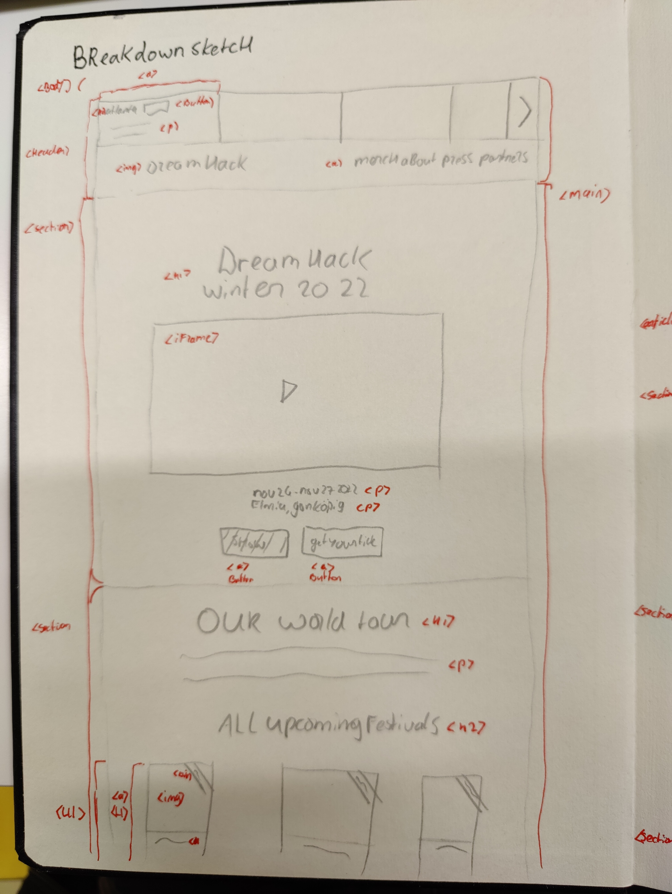
  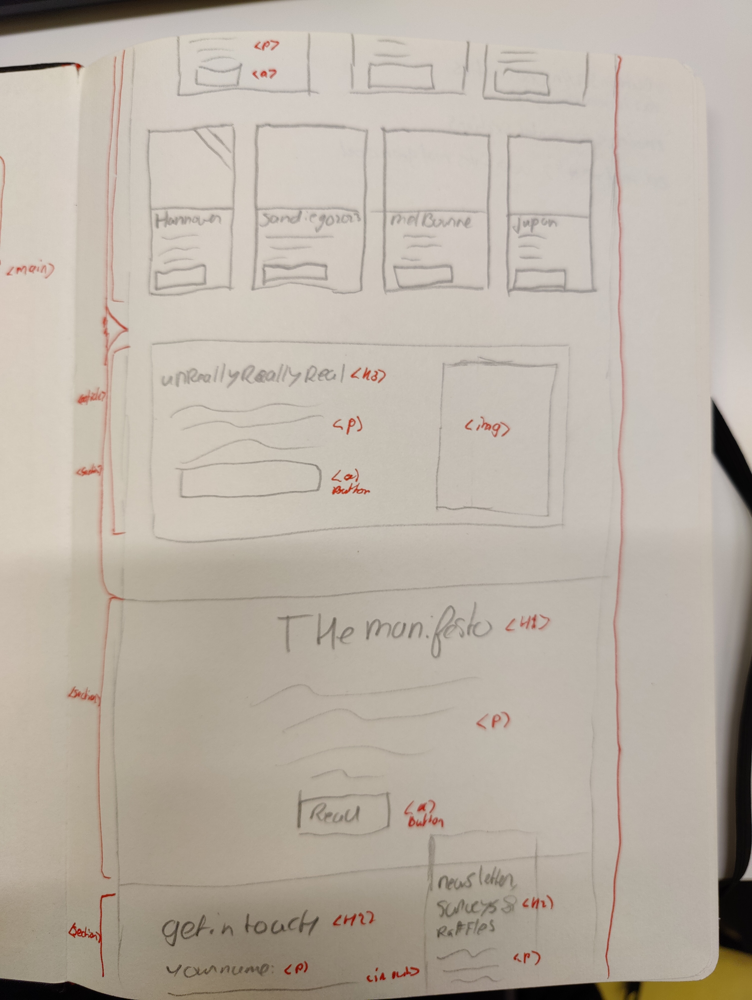
  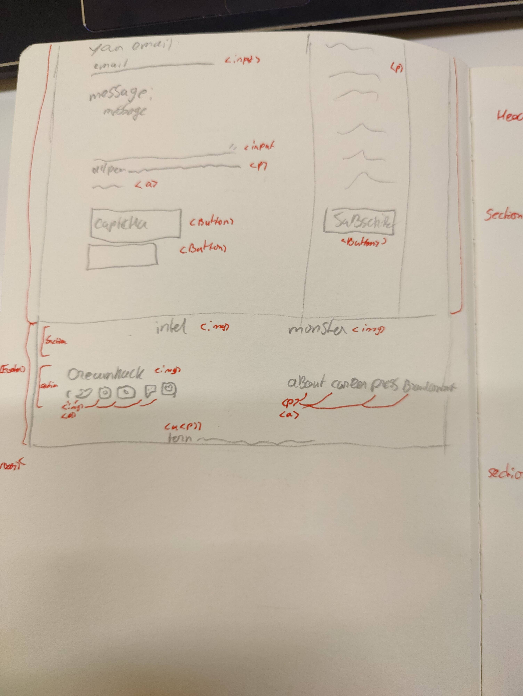

  ### de hele pagina in small screen: 
  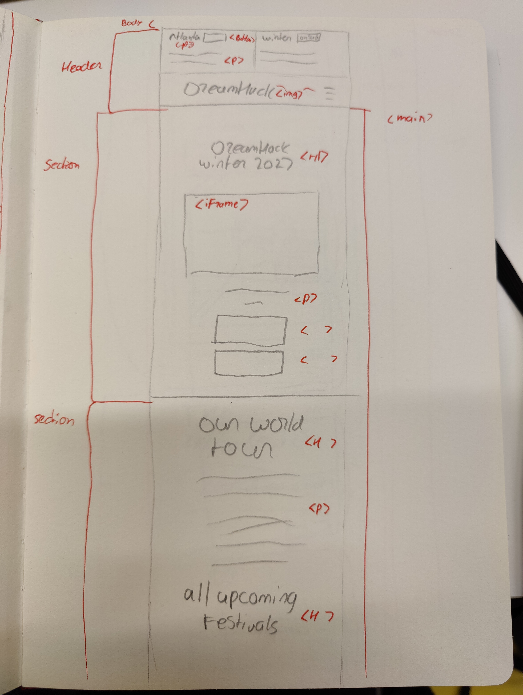

  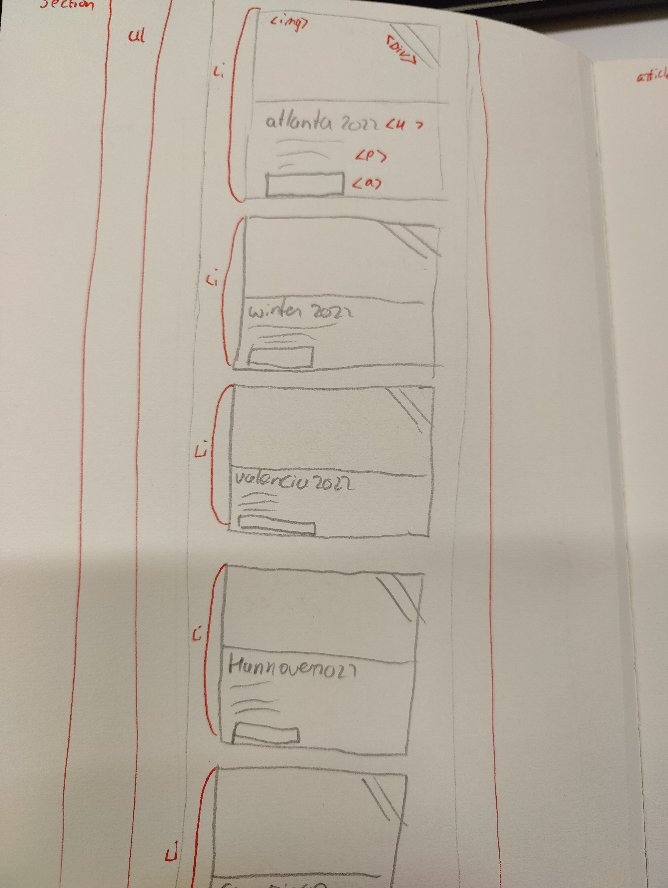

  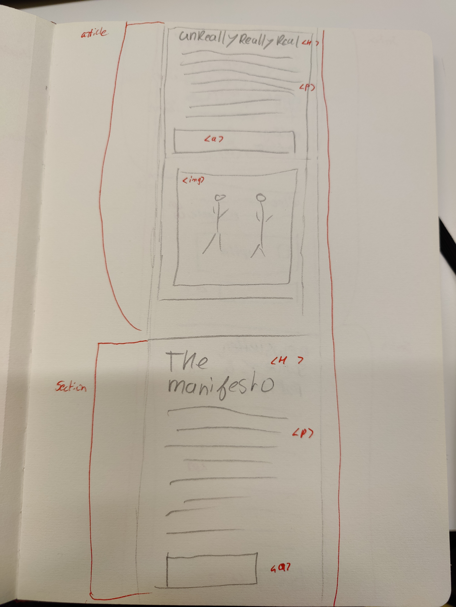

  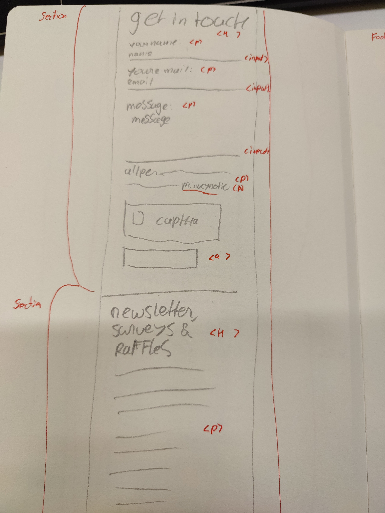

  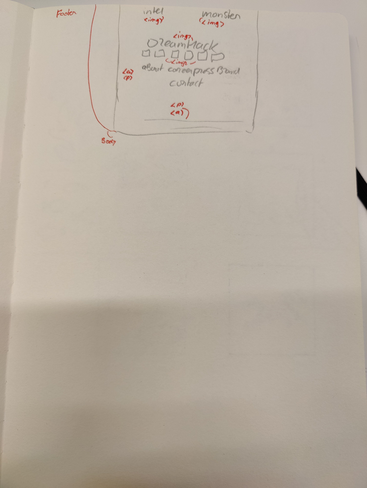

## Voortgang 1 (week 2)

  
uitwerken voor 1e voortgang

  ### Stand van zaken
  het verliep wel soepel. heb wat extra geleerd over headers verstoppen en javascript maar het loopt wel lekker

  ### Agenda voor meeting
  samen met je groepje opstellen

  Stef: Hoe maak je een draggable carrousel
  ...
  ...
  ...

  ### Verslag van meeting
  hier na afloop snel de uitkomsten van de meeting vastleggen

  - geen feedback gekregen waar ik wat mee kon. maar had ook nog niet heel veel vragen
  - 
  - 
  - ...

## Voortgang 2 (week 3)

  
uitwerken voor 2e voortgang

  ### Stand van zaken
  Ben gevorderd in html/css en js. heb geleerd over lists, svgs, headers verstoppen, grid en nog een aantal dingen.

  heb de eerste pagina af en ga beginnen aan de 2de die een stuk sneller moet gaan met de data die ik nu al heb.

  ### Agenda voor meeting
  samen met je groepje opstellen

  Stef: Hoe maak je een draggable carrousel
  ...
  ...
  ...

  ### Verslag van meeting
  hier na afloop snel de uitkomsten van de meeting vastleggen

  -  Feedback gekregen over hoe ik het niet draggable hoef te maken
  - 
  - 
- ...

## Toegankelijkheidstest 2/2 (week 4)

  
uitwerken na test in 8e werkgroep

  ### Bevindingen
  Lijst met je bevindingen die in de test naar voren kwamen (geef ook aan wat er verbeterd is):

  door header heen tabben is verbeterd op mijn site

  #### Screenreader
  Hier korte omschrijving (met indien nodig afbeeldingen)

  geen headings per pagina

  Hier een omschrijving van hoe het opgelost kan worden (met indien nodig afbeeldingen)

  onzichtbare headers maken.

  #### Muis en Toetsenbord 
  Hier korte omschrijving (met indien nodig afbeeldingen)

  geen problemen

  Hier een omschrijving van hoe het opgelost kan worden (met indien nodig afbeeldingen)

  ~

  #### Motoriek (shocks, elastiekjes)
  Hier korte omschrijving (met indien nodig afbeeldingen)

  geen moeilijkheden gevonden op mijn website wat niet al gezegd is

  Hier een omschrijving van hoe het opgelost kan worden (met indien nodig afbeeldingen)

 ~

  #### Visueel (brillen, contrast, kleurenblind, dark/light). 
  Hier korte omschrijving (met indien nodig afbeeldingen)

  Hier een omschrijving van hoe het opgelost kan worden (met indien nodig afbeeldingen)

## Voortgang 3 (week 4)

  
uitwerken voor 3e voortgang

  ### Stand van zaken
  alles loopt goed. moet nog een aantal dingetjes verbeteren voor het eindgesprek maar ben al blij met mijn resultaat.

  ### Agenda voor meeting
  samen met je groepje opstellen

 Stef: geen vragen. alleen dingen afmaken
 -
 -
 -

  ### Verslag van meeting
  hier na afloop snel de uitkomsten van de meeting vastleggen

  - niets meegekregen van de meeting
  - 
  - 
  - ...

## Eindgesprek (week 5)

  
uitwerken voor eindgesprek

  ### Je uitkomst - karakteristiek screenshots:
  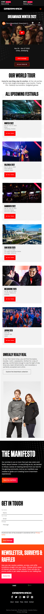
  

  ### Dit ging goed/Heb ik geleerd: 
  Korte omschrijving met plaatjes

  ik heb zo mega veel geleerd in dit vak dat ik niet echt alles kan benoemen maar ik ga mijn best doen.

  ik heb leren coderen zonder div's en zonder margin te gebruiken voor de hierarchie en alleen voor vormgeving. 

  ook heb ik extra kennis opgedaan in javascript. bijvoorbeeld het menu in laten klappen en 

  ### Dit was lastig/Is niet gelukt:
  

  ik heb niet echt iets wat niet gelukt is. er zijn wel een paar dingetjes zoals de skip-to-content button en nog een paar andere aanpassingen die ik had willen toevoegen als ik iets meer tijd had.

## Bronnenlijst

  
continu bijhouden terwijl je werkt

  Nb. Wees specifiek ('css-tricks' als bron is bijv. niet specifiek genoeg).

  ten eerste is mijn grootste bron sanne 't hooft. Daar heb ik het meeste vandaan gehaald

  1. https://www.w3schools.com/howto/howto_js_mobile_navbar.asp
  2. https://www.w3schools.com/html/html_favicon.asp
  3. https://www.w3schools.com/html/html_scripts.asp
  4. https://www.w3schools.com/html/html_responsive.asp
  5. https://www.w3schools.com/html/html5_semantic_elements.asp
  6. https://www.w3schools.com/css/css_selectors.asp

